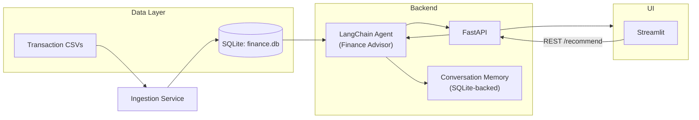

# AI Personal Finance Advisor Agent – Hands-On Lab

## 1. Project Overview
- **Project Title:** AI Personal Finance Advisor Agent  
- **Business Problem Statement:** Retail banking customers struggle to understand their spending habits and create actionable plans to reach savings or investment goals. Traditional advisory services are expensive and not always accessible.  
- **Business Goals & Expected Outcomes:** Deliver personalized financial insights, automate budgeting recommendations, and increase user retention through proactive financial coaching.  
- **Industry Context:** Neobanks and fintech firms leverage AI to drive customer loyalty. Personalized financial assistants help reduce churn, boost cross-sell of savings/investment products, and improve net promoter scores.  
- **Key Features & Functional Scope:** Secure data ingestion, LangChain-based agent with short-term memory, FastAPI backend, Streamlit dashboard, SQLite storage for sample data, pytest suite, and Docker-based deployment.

## 2. Functional & Non-Functional Requirements
- **Business Requirements**
  - R1: Ingest monthly financial transactions and profile details via CSV or API.  
  - R2: Provide insights on spending categories and savings rate.  
  - R3: Recommend budget adjustments aligned with user goals (e.g., emergency fund, vacation).  
  - R4: Suggest investment allocations based on risk tolerance and liquidity needs.  
  - R5: Offer an interactive UI where users can tweak assumptions and regenerate advice.
- **User Stories & Acceptance Criteria**
  - *As a user*, I want to upload my expense data so that the advisor can analyze spending. **AC:** `/ingest` accepts CSV and stores records in SQLite.  
  - *As a user*, I want to ask “How much can I save monthly?” and receive a detailed response. **AC:** `/recommend` returns summary, recommended actions, and justification.  
  - *As a finance coach*, I want to review generated recommendations. **AC:** `/history` lists recent conversations with timestamps.  
  - *As a platform admin*, I want the agent to maintain session context. **AC:** LangChain memory persists last N interactions in SQLite-backed store.
- **Non-Functional Requirements**
  - **Security:** Environment variables for API keys; PII minimized; sample data free from real user info.  
  - **Performance:** Recommendations generated within 2 seconds for typical datasets (<1000 transactions).  
  - **Maintainability:** Modular architecture with config, services, data access layers, and clear docstrings.  
  - **Scalability:** Abstract data layer allows switching from SQLite to cloud databases.  
  - **Observability:** Structured logging; latency tracking on recommendation endpoint.

## 3. Solution Architecture


- **Components & Interactions:** FastAPI orchestrates requests, invokes LangChain agent to produce recommendations, accesses SQLite via DAO layer, and exposes REST endpoints consumed by Streamlit UI. Memory keeps chat context per user session.  
- **Data Flow:** CSV ingestion populates SQLite tables. Recommendation endpoint loads financial profile + transactions, constructs prompt templates, calls LLM, and stores conversation history.  
- **API Design:**  
  - `POST /ingest`: Upload or load sample data.  
  - `GET /users`: List available user profiles.  
  - `POST /recommend`: Body contains `user_id` and optional `question`.  
  - `GET /history`: Return last interactions for a user.  
  - `GET /health`: Service status.  
- **Database Design:** SQLite with tables `users`, `transactions`, `goals`, `conversations`. Foreign key: `transactions.user_id -> users.id`; `goals.user_id -> users.id`; `conversations.user_id -> users.id`.

## 4. Technical Implementation
- **Tech Stack:** Python 3.11, FastAPI, LangChain, SQLite, SQLModel / SQLAlchemy, Streamlit, PyTest, Docker.  
- **Folder Structure**
  ```
  ai-proj-1/
  ├── README.md
  ├── main.py
  ├── requirements.txt
  ├── docker-compose.yml
  ├── Dockerfile
  ├── .env.example
  ├── data/
  │   └── sample_transactions.csv
  ├── src/
  │   ├── __init__.py
  │   ├── backend/
  │   │   ├── __init__.py
  │   │   ├── app.py
  │   │   ├── config.py
  │   │   ├── db.py
  │   │   ├── models.py
  │   │   ├── schemas.py
  │   │   ├── services.py
  │   │   ├── agent.py
  │   │   ├── ingestion.py
  │   │   └── utils.py
  │   └── frontend/
  │       ├── __init__.py
  │       └── app.py
  ├── streamlit_app.py
  └── tests/
      ├── __init__.py
      ├── conftest.py
      ├── test_db.py
      ├── test_agent.py
      └── test_api.py
  ```
- **Environment Setup**
  1. `python -m venv .venv && source .venv/bin/activate`  
  2. `pip install -r requirements.txt`  
  3. Copy `.env.example` to `.env` and set `OPENAI_API_KEY` (or toggle fake LLM).  
  4. `python main.py` to run FastAPI, `streamlit run streamlit_app.py` for UI.
- **Development Guide**
  1. Study config options in `src/backend/config.py`.  
  2. Load sample data: `python -m src.backend.ingestion --seed`.  
  3. Use `/recommend` via cURL or Streamlit UI.  
  4. Modify prompt templates in `src/backend/agent.py` to experiment with advisory tone.  
  5. Adjust memory window or risk heuristics in `src/backend/services.py`.  
  6. Run tests with `pytest`.  
  7. Containerize using `docker compose up --build`.
- **Source Code:** Modular backend provides models, services, and agent logic. Streamlit app consumes REST endpoints and visualizes budgets, savings, and recommended allocations.  
- **Tests:** PyTest covers DB ingestion, agent recommendations (with fake LLM), and API endpoints.  
- **Docker:** Multi-stage Dockerfile builds FastAPI app; docker-compose orchestrates API + Streamlit with shared environment.  
- **Configuration:** `.env` for secrets, toggles for fake LLM/memory length, DB path, allowed origins.

## 5. Hands-On Lab Instructions
1. **Environment Prep:** Set up virtual environment, install dependencies, configure `.env`. Verify `python main.py` launches API on `http://localhost:8001`.  
2. **Load Sample Data:**  
   - Run `python -m src.backend.ingestion --seed` to load sample CSV into SQLite.  
   - Inspect `finance.db` (optional via `sqlite3`).  
3. **Explore API:**  
   - `curl -X GET http://localhost:8001/users` to list profiles.  
   - `curl -X POST http://localhost:8001/recommend -H "Content-Type: application/json" -d '{"user_id": 1, "question": "How do I reach my vacation fund?"}'`.  
4. **Launch Streamlit UI:** `streamlit run streamlit_app.py`; select a profile, view spending breakdown, and request advice.  
5. **Modify the Agent:** Update prompt strings or risk heuristics, rerun tests, and observe new outputs in Streamlit.  
6. **Testing & Validation:** Execute `pytest` and review coverage logs.  
7. **Docker Deployment:** Build and run with `docker compose up --build`; interact via `http://localhost:8501`.

## 6. Validation & Testing
- **Manual Test Cases**
  - `TC-01`: Ingest sample CSV, ensure `/users` returns 3 profiles.  
  - `TC-02`: Request recommendation for user 1; response includes savings plan and suggested allocations.  
  - `TC-03`: Change monthly goal and recompute; verify agent adjusts advice proportionally.  
  - `TC-04`: Streamlit UI displays total expenses vs. income chart.  
  - `TC-05`: Latency under 2 seconds for recommendation endpoint.
- **Automated Coverage:** `tests/test_db.py` checks ingestion & query logic; `tests/test_agent.py` validates prompt formatting and fallback; `tests/test_api.py` ensures endpoints respond correctly with fake LLM.  
- **Sample Data:** `data/sample_transactions.csv` includes multiple categories (rent, groceries, entertainment, investments) plus income and goal columns.  
- **Troubleshooting:**  
  - Missing API key → enable fake LLM via env var `USE_FAKE_LLM=1`.  
  - DB locked → ensure only one process writes to SQLite.  
  - Slow responses → reduce memory window or disable verbose logging.

## 7. Reflection & Learning Outcomes
- **Skills Practiced:** Financial data ingestion, LangChain agent design, FastAPI development, REST/Streamlit integration, testing, Dockerization.  
- **Real-World Applications:** Personal finance coaching apps, bank advisory chatbots, wealth management tools.  
- **Next Steps:** Integrate with real transaction APIs (Plaid), add anomaly detection, support multi-user authentication, deploy to cloud (GCP/AWS/Azure), and integrate budget notifications via email/SMS.
