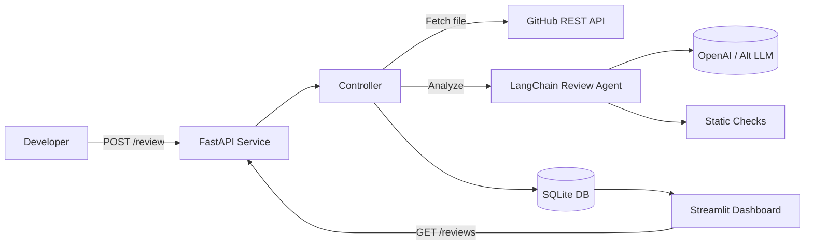

# AI Code Reviewer Agent – Hands-On Lab

## 1. Project Overview
- **Project Title:** AI Code Reviewer Agent
- **Business Problem Statement:** Software teams spend significant time on manual code reviews, leading to bottlenecks, inconsistent feedback, and potential quality gaps. An AI-assisted reviewer can highlight issues early, standardize guidance, and accelerate pull request cycles.
- **Business Goals & Expected Outcomes:** Reduce review turnaround time, improve defect detection, and provide actionable refactoring suggestions to developers before human review. Increase developer productivity by automating routine feedback.
- **Industry Context:** Developer productivity tools and DevOps platforms increasingly embed AI assistants to maintain code quality at scale. Automated reviewers help organizations enforce style guides, catch performance pitfalls, and support continuous delivery.
- **Key Features & Functional Scope:** FastAPI backend that analyzes Python code via LangChain + OpenAI, GitHub integration for source retrieval, structured JSON response with categorized findings, SQLite storage for review history, Streamlit dashboard for visualization (optional), pytest coverage, Dockerized setup.

## 2. Functional & Non-Functional Requirements
- **Business Requirements:**
  - R1: Allow users to submit code snippets or GitHub references for analysis.
  - R2: Generate structured review reports (issue type, description, severity, suggested fix).
  - R3: Log reviews with metadata (repo, commit, author) for auditing.
  - R4: Provide REST endpoints to trigger reviews and fetch historical reports.
  - R5: Offer configuration to switch between different LLM providers.
- **User Stories & Acceptance Criteria:**
  - *As a developer*, I want to submit a file path/URL and get a list of issues. **AC:** `/review` returns JSON containing `issues` array with severity and explanation.
  - *As a team lead*, I want to monitor review history. **AC:** `/reviews` supports filtering by repository and date.
  - *As a DevOps engineer*, I want to integrate code reviews in CI. **AC:** `/review` endpoint responds within 5 seconds for <500 LOC.
  - *As a compliance officer*, I want audit logs stored in SQLite. **AC:** review metadata persisted with timestamps and user info.
- **Non-Functional Requirements:**
  - Security: Use API keys via environment variables; sanitize GitHub inputs; enforce rate limits.
  - Performance: Process medium-sized Python files (<1000 LOC) under 5 seconds with cached embeddings.
  - Reliability: Retry GitHub API calls; fallback to local provided code when external fetch fails.
  - Observability: Structured logging, request correlation IDs, metrics on review duration.
  - Maintainability: Modular service layers, typed Pydantic models, unit tests for core logic.

## 3. Solution Architecture


- **Components & Interactions:** FastAPI handles requests, invokes a `ReviewPipeline` service that fetches code (from GitHub or payload), runs static heuristics + LLM critique via LangChain, aggregates results, and stores audits in SQLite. Streamlit dashboard consumes the API for visual insights.
- **Data Flow:** Request -> optional GitHub fetch -> combined analysis -> structured JSON -> persist to SQLite -> return response -> accessible via reporting endpoints/UI.
- **API Design:**
  - `POST /review`: Request body includes `code`, `repo`, `commit_sha`, `file_path`. Response returns summary and issue list.
  - `GET /reviews`: Query params `repo`, `limit`, `offset`. Response includes paginated history.
  - `GET /reviews/{id}`: Fetch single review report.
  - `GET /health`: Service heartbeat.
- **Database Design:** SQLite tables `reviews` (id PK, repo, file, commit, summary, created_at) and `issues` (id PK, review_id FK, severity, type, description, suggestion, line_start, line_end).

## 4. Technical Implementation
- **Tech Stack:** Python 3.11, FastAPI, LangChain, langchain-openai, GitHub REST API via `httpx`, SQLModel/SQLite, Streamlit (optional UI), PyTest, Docker.
- **Folder Structure:**
  ```
  ai-proj-2/
  ├── README.md
  ├── main.py
  ├── requirements.txt
  ├── docker-compose.yml
  ├── Dockerfile
  ├── .env.example
  ├── data/
  │   └── samples/quick_sort.py
  ├── src/
  │   ├── __init__.py
  │   ├── backend/
  │   │   ├── __init__.py
  │   │   ├── app.py
  │   │   ├── config.py
  │   │   ├── db.py
  │   │   ├── models.py
  │   │   ├── schemas.py
  │   │   ├── github_client.py
  │   │   ├── reviewers.py
  │   │   ├── services.py
  │   │   └── utils.py
  │   └── frontend/
  │       └── dashboard.py
  ├── streamlit_app.py
  └── tests/
      ├── __init__.py
      ├── conftest.py
      ├── test_github_client.py
      ├── test_reviewer.py
      └── test_api.py
  ```
- **Environment Setup:**
  1. `python -m venv .venv && source .venv/bin/activate`
  2. `pip install -r requirements.txt`
  3. Copy `.env.example` to `.env`, configure `OPENAI_API_KEY`, `GITHUB_TOKEN`, and toggles like `USE_FAKE_LLM` for offline mode.
  4. Run `python main.py` (or `pytest` first) and optionally `streamlit run streamlit_app.py`.
- **Development Guide:**
  1. Inspect configuration in `src/backend/config.py` and adjust defaults.
  2. Seed sample review data using provided script or API call.
  3. Implement optional static checks in `reviewers.py` to complement LLM feedback.
  4. Adjust prompt templates for targeted feedback (performance, style, etc.).
  5. Extend GitHub integration to support pull request diffs.
  6. Implement additional severity mapping and customizing output filter.
  7. Package via Docker for CI integration (`docker compose up --build`).
- **Source Code:** Code includes modular reviewers combining heuristics and LangChain calls; GitHub client leverages tokens with fallback; DB layer uses SQLModel for simple CRUD.
- **Tests:** Pytest verifies GitHub fetch stub, reviewer outputs with fake LLM, API endpoints returning structured JSON.
- **Docker:** Multi-stage Dockerfile builds runtime with dependencies; docker-compose orchestrates API + optional Streamlit.
- **Configuration:** `.env` handles API keys, optional toggles for fake LLM/GitHub; secrets never stored in repo.

## 5. Hands-On Lab Instructions
1. **Environment Setup:** Prepare Python venv, install dependencies, configure `.env` with tokens or enable fake modes.
2. **Run Base Project:** `python main.py`; call `/health` to confirm service readiness.
3. **Trigger First Review:** Use `curl` or Postman to POST sample code; examine JSON results.
4. **UI Exploration:** Launch `streamlit run streamlit_app.py` for historical review visualization.
5. **Modify Prompts:** Update `reviewers.py` templates to emphasize performance vs style; rerun tests to confirm behavior.
6. **Integrate Alternative LLM:** Toggle to use deterministic fallback vs OpenAI; update `.env` to experiment with different providers.
7. **Docker Deployment:** `docker compose up --build`; test endpoints via containerized environment.
8. **Extension Ideas:** Add classification for security issues, support multi-file diffs, integrate Slack notifications.

## 6. Validation & Testing
- **Manual Tests:**
  - Submit provided sample file; expect at least one issue flagged (style/performance).
  - Request review history and confirm saved metadata.
  - Trigger review with invalid GitHub repo; expect graceful error message.
  - Run UI filters by repo to view relevant entries.
- **Automated Tests:** `pytest` covers GitHub client fallback, review pipeline outputs, and API responses for valid/invalid payloads.
- **Sample Data:** Provided `quick_sort.py` with known inefficiencies for reproducible suggestions.
- **Troubleshooting:**
  - Missing API keys -> enable fake modes or ensure `.env` values.
  - GitHub rate limit -> use caching or adjust token scopes.
  - Slow responses -> narrow review scope (selected files) or limit heuristics.

## 7. Reflection & Learning Outcomes
- **Skills Practiced:** LangChain tool orchestration, FastAPI design, GitHub API consumption, structured reporting, unit testing, Dockerization.
- **Real-World Applications:** Automated code review assistants, CI/CD gating, developer education tools.
- **Next Steps:** Support multi-language reviews, integrate with GitHub Apps for automated PR comments, implement severity ML models, deploy on cloud-managed services.
