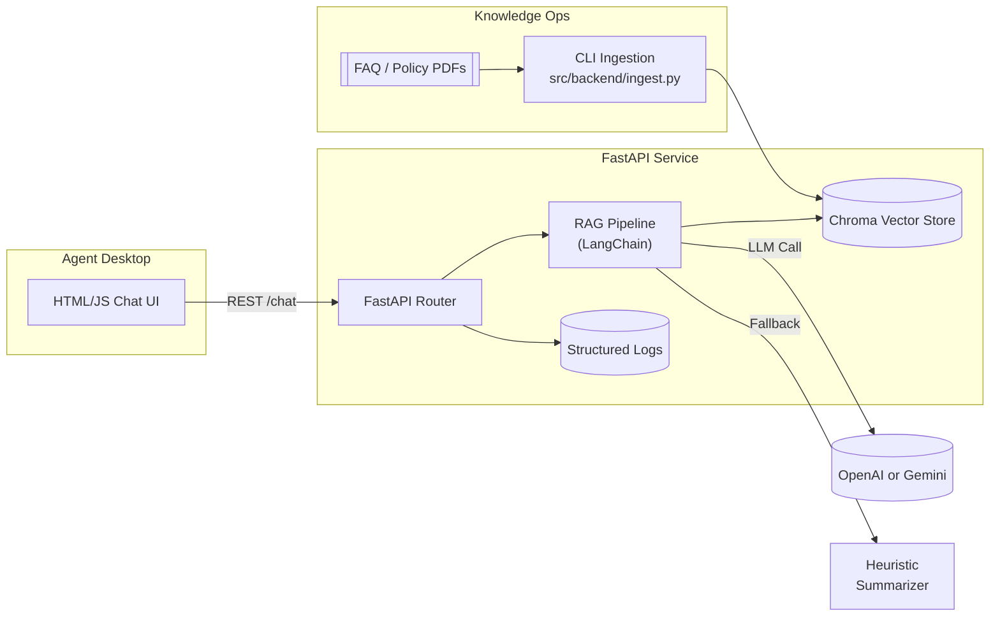

# Customer Support Agent using RAG – Hands-On Lab

## 1. Project Overview
- **Project Title:** Telecom Customer Support RAG Agent  
- **Business Problem Statement:** Telecom contact centers struggle with long resolution times and inconsistent answers because agents must sift through large policy manuals and FAQ documents.  
- **Business Goals & Expected Outcomes:** Reduce average handling time (AHT), improve first-contact resolution (FCR), and ensure agents always deliver policy-compliant responses.  
- **Real-World Relevance / Industry Context:** Telecom providers manage evolving service plans, device policies, and regulatory mandates. An AI-powered retrieval-augmented generation (RAG) agent can surface authoritative answers from curated knowledge bases, keeping support teams aligned with the latest rules.  
- **Key Features & Functional Scope:** Ingestion pipeline for FAQ PDFs, FastAPI backend with retrieval + generative response workflow, HTML/JS chat interface, latency and accuracy tests, Dockerized local deployment, lab guide for extending the corpus.

## 2. Functional & Non-Functional Requirements
- **Business Requirements**
  - R1: Allow knowledge managers to ingest new FAQ/policy PDFs into the knowledge base.  
  - R2: Provide a chat endpoint that retrieves relevant context and crafts policy-aligned answers.  
  - R3: Return citations (document titles/page numbers) with each answer for agent audits.  
  - R4: Support agent feedback loop by exposing most relevant passages.  
  - R5: Offer health/status endpoints to integrate with monitoring tools.
- **User Stories & Acceptance Criteria**
  - *As a support agent*, I want to ask a policy question and receive an answer with citations so I can respond confidently. **AC:** When posting to `/chat`, response contains `answer` and `sources`.  
  - *As a knowledge manager*, I want to upload new FAQ PDFs so the bot reflects updated policies. **AC:** Calling `/ingest` provides processed file count and persists embeddings.  
  - *As a team lead*, I want to review recent questions and answers. **AC:** `/history` endpoint returns chat logs.  
  - *As a DevOps engineer*, I want infrastructure-as-code artifacts. **AC:** Dockerfile and docker-compose enable local deployment.
- **Non-Functional Requirements**
  - **Scalability:** Modular pipeline; Chroma vector store on disk, replaceable with managed services.  
  - **Security:** API keys loaded via environment variables; no keys stored in codebase; CORS restricted to approved origins via env.  
  - **Performance:** Chat responses under 2 seconds when embeddings and LLM cache warm; latency test ensures contracts.  
  - **Reliability:** Persisted vector store prevents re-ingestion on restart; ingestion idempotent.  
  - **Observability:** Structured logging and latency metrics emitted per request.  
  - **Maintainability:** Layered architecture (config → ingestion → retrieval → API) with docstrings and unit tests.

## 3. Solution Architecture


- **Components & Interactions:** Frontend chat UI invokes FastAPI `/chat`; router delegates to `RAGPipeline` for retrieval and answer synthesis. Ingestion CLI and API share pipeline instance. Vector store persists embeddings to `storage/chroma`.  
- **Data Flow & Integration Points:** PDFs → loader + text splitter → embeddings (OpenAI/Gemini or deterministic hash) → Chroma. Query uses embeddings similarity search, then LLM or fallback to craft response.  
- **API Design:**  
  - `GET /health`: health check.  
  - `POST /ingest`: body `{ "source_dir": str | null }`; returns processed document metrics.  
  - `POST /chat`: body `{ "question": str }`; returns `{ "answer": str, "sources": list }`.  
  - `GET /history`: optional `limit` query; returns recent exchanges.  
  - `GET /config`: surface runtime configuration sans secrets.  
  - `Static /`: Serves chat UI.
- **Database Design:**  
  - Chroma collection `telecom_support_docs` with fields: `id`, `embedding`, `metadata` (source file, page, title, chunk_id).  
  - Optional SQLite (via Chroma) stores persist directory; no relational tables required.

## 4. Technical Implementation
- **Tech Stack:** Python 3.11, FastAPI, LangChain, LangChain-Community loaders, ChromaDB, OpenAI/Gemini (optional) for generation, deterministic fallback LLM, HTML/CSS/JS frontend, Docker, PyTest.
- **Folder Structure**
  ```
  ai-proj-3/
  ├── README.md
  ├── main.py
  ├── requirements.txt
  ├── docker-compose.yml
  ├── Dockerfile
  ├── .env.example
  ├── data/
  │   └── sample_faqs/telecom_support_faq.pdf
  ├── storage/            # created at runtime by Chroma
  ├── src/
  │   ├── __init__.py
  │   ├── backend/
  │   │   ├── __init__.py
  │   │   ├── app.py
  │   │   ├── config.py
  │   │   ├── ingest.py
  │   │   ├── pipeline.py
  │   │   ├── schemas.py
  │   │   └── utils.py
  │   └── frontend/
  │       ├── __init__.py
  │       ├── app.js
  │       ├── index.html
  │       └── styles.css
  └── tests/
      ├── __init__.py
      ├── conftest.py
      ├── test_pipeline.py
      └── test_latency.py
  ```
- **Environment Setup**
1. `python -m venv .venv && source .venv/bin/activate`  
2. `pip install -r requirements.txt`  
3. Copy `.env.example` to `.env`, add `OPENAI_API_KEY` or `GEMINI_API_KEY` (optional), set `FRONTEND_ORIGIN`.  
4. `pytest` to validate the pipeline locally.  
5. `python main.py` to start API and static UI at `http://localhost:8000`.
- **Development Guide**
  1. Review `Settings` in `src/backend/config.py`.  
  2. Run initial ingestion: `python -m src.backend.ingest --source data/sample_faqs`.  
  3. Launch FastAPI (`python main.py`); verify health endpoint.  
  4. Open `frontend/index.html` via served static route; ask sample question.  
  5. Adjust prompt templates or top-k in `src/backend/pipeline.py` for tuning.  
  6. Add new PDFs and re-run ingestion; tests ensure coverage using deterministic embeddings.  
  7. Use Docker for consistent runtime: `docker compose up --build`.
- **Source Code:** Backend orchestrates ingestion/retrieval; pipeline provides fallback heuristics; frontend handles chat interactions with fetch API. Scripts and tests align with lab steps.
- **Unit & Integration Tests:** PyTest suite verifies ingestion, retrieval, API latency.  
- **Docker:** Multi-stage `Dockerfile` packages app; `docker-compose.yml` exposes port 8000 and mounts `data/` for updates.  
- **Configuration:** `.env` for secrets; pipeline gracefully degrades to deterministic embeddings/LLM when keys absent.

## 5. Hands-On Lab Instructions
1. **Environment Prep:** Create virtual environment, install dependencies, configure `.env`. Validate `python main.py` boots server.  
2. **Run Base Project:**  
   - `python -m src.backend.ingest --source data/sample_faqs`  
   - `python main.py` and browse to `http://localhost:8000`  
   - Ask: “What is the process for international roaming activation?” to view answer + citations.  
3. **Modify the Project:**  
   - Update `src/backend/pipeline.py` to adjust chunk size or temperature.  
   - Add new sample PDF policy under `data/new_docs`, re-run ingestion.  
   - Extend UI by adding message typing indicator in `src/frontend/app.js`.  
4. **Test the Application:**  
   - Run `pytest` for pipeline and latency checks.  
   - Use `scripts/postman_collection.json` (generate via instructions) or manual Postman call to `/chat`.  
5. **Deploy with Docker:** `docker compose up --build`; confirm logs show ingestion path; run curl commands from host.  
6. **Explore Extensions:** Connect to managed vector store (e.g., Pinecone), integrate agent handoff via webhooks, add analytics dashboard.

## 6. Validation & Testing
- **Manual Test Cases**
  - `TC-01 Chat Success:` Ingest sample docs, ask general FAQ, expect relevant answer with two citations.  
  - `TC-02 Missing Docs:` Delete `storage/`, call `/chat` without ingestion; expect informative error.  
  - `TC-03 New Document:` Add pdf with cancellation policy, re-ingest, verify new knowledge available.  
  - `TC-04 Latency Budget:` Measure `/chat` response, ensure under 2s with warmed embeddings.  
  - `TC-05 Frontend UX:` UI displays streaming spinner and clears input after response.
- **Automated Coverage:** `tests/test_pipeline.py` covers ingestion + retrieval fallback; `tests/test_latency.py` asserts API response time budget using TestClient.  
- **Sample Data:** `data/sample_faqs/telecom_support_faq.pdf` includes roaming, billing disputes, SIM replacement policies.  
- **Troubleshooting Tips:**  
  - Missing embeddings? Delete `storage/` and rerun ingestion.  
  - API key errors? Confirm `.env` loaded; restart app.  
  - Slow responses? Increase `CHROMA_COLLECTION_CACHE_SIZE` or reduce `top_k`.

## 7. Reflection & Learning Outcomes
- **Skills Practiced:** RAG architecture design, vector database operations, FastAPI development, LangChain orchestration, frontend-backend integration, Docker packaging, automated testing.  
- **Real-World Applications:** Telecom support, insurance claims, HR policy bots, regulated compliance desks.  
- **Next Steps / Advanced Topics:** Integrate streaming responses, implement feedback loop storing thumbs-up/down, add continuous ingestion pipeline (Airflow), deploy on managed cloud (GKE/ECS), secure endpoints with OAuth and audit logging.
