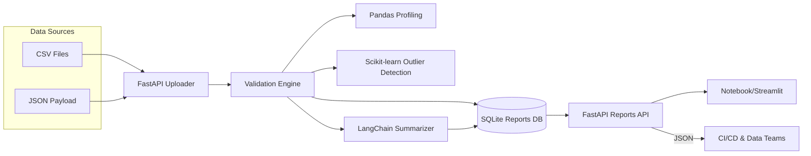

# AI Data Quality Validation Agent – Hands-On Lab

## 1. Project Overview
- **Project Title:** AI Data Quality Validation Agent
- **Business Problem Statement:** Analytics teams often struggle with inconsistent, incomplete, or anomalous datasets entering BI and ML pipelines. Manual validation is time-consuming and prone to human error, leading to poor decision-making and costly rework.
- **Business Goals & Expected Outcomes:** Automate detection of data quality issues, provide prioritized remediation guidance, and deliver summarized reports to stakeholders. Reduce time spent on validation, improve trust in analytics outputs, and enable rapid iteration on data products.
- **Real-World Relevance / Industry Context:** Enterprises running large-scale ETL processes require data quality gates to keep dashboards and models reliable. Automated validation agents are essential in finance, retail, healthcare, and any regulated industry where data accuracy is critical.
- **Key Features & Functional Scope:** Upload or reference datasets, perform statistical quality checks (missing data, outliers, schema consistency), store results, generate natural language summaries via LangChain, expose FastAPI endpoints, Streamlit/Jupyter companion assets for exploration, pytest coverage, Docker packaging.

## 2. Functional & Non-Functional Requirements
- **Business Requirements:**
  - R1: Ingest CSV/JSON datasets for validation via REST or file path.
  - R2: Detect missing values, duplicate records, statistical outliers, and schema mismatches.
  - R3: Persist validation results and raw metrics for auditing.
  - R4: Produce an automated narrative report summarizing issues and remediation tips.
  - R5: Provide downloadable artifacts (JSON and Markdown) for pipeline integration.
- **User Stories & Acceptance Criteria:**
  - *As a data engineer*, I want to submit a dataset and receive a structured quality report. **AC:** `/validate` returns summary, metrics, issue list, and recommendations.
  - *As an analytics lead*, I want to review historical validations. **AC:** `/reports` returns paginated history with metadata.
  - *As a platform owner*, I need configurable thresholds for outlier detection. **AC:** Settings allow customizing z-score bounds and missing value tolerances.
  - *As a compliance auditor*, I need a persistent record. **AC:** Validation metadata stored in SQLite with timestamps and dataset references.
- **Non-Functional Requirements:**
  - Security: API keys handled via environment variables; restrict file access paths; sanitize JSON inputs.
  - Performance: Handle medium datasets (<= 50k rows) under 10 seconds with streaming reads.
  - Reliability: Graceful fallbacks when LLM unavailable; deterministic summarizer option.
  - Observability: Structured logging, metrics for validation duration and counts.
  - Maintainability: Modular validation checks, Pydantic models, documented notebook.

## 3. Solution Architecture


- **Components & Interactions:** FastAPI receives datasets or file references, triggers validation pipeline (Pandas computations, scikit-learn outlier detection, rule checks). Results stored in SQLite and summarized using LangChain. Reports accessible via API endpoints, Jupyter notebook, or Streamlit dashboard.
- **Data Flow & Integration Points:** Data ingestion -> validation metrics -> structured report -> summary generation -> persistence -> retrieval via API/UI. Optional integration with cloud storage for inputs.
- **API Design:**
  - `POST /validate` – Body: dataset (inline JSON rows) or `data_path`. Response: report metadata, issues, summary, remediation tips.
  - `GET /reports` – Query params: `limit`, `offset`, `dataset_name`. Returns paginated report summaries.
  - `GET /reports/{report_id}` – Detailed report including metrics and issues.
  - `GET /health` – Service heartbeat.
- **Database Design:** SQLite tables `validation_reports` (id PK, dataset_name, total_rows, missing_rate, outlier_rate, summary, created_at) and `issues` (id PK, report_id FK, issue_type, severity, description, recommendation, affected_columns).

## 4. Technical Implementation
- **Tech Stack:** Python 3.11, FastAPI, Pandas, Scikit-learn, LangChain (OpenAI optional, deterministic fallback), SQLModel/SQLite, Streamlit notebook companion, PyTest, Docker.
- **Folder Structure:**
  ```
  ai-proj-4/
  ├── README.md
  ├── main.py
  ├── requirements.txt
  ├── docker-compose.yml
  ├── Dockerfile
  ├── .env.example
  ├── data/
  │   └── samples/retail_sales.csv
  ├── notebooks/
  │   └── data_quality_walkthrough.ipynb
  ├── src/
  │   ├── __init__.py
  │   ├── backend/
  │   │   ├── __init__.py
  │   │   ├── app.py
  │   │   ├── config.py
  │   │   ├── db.py
  │   │   ├── models.py
  │   │   ├── schemas.py
  │   │   ├── validators.py
  │   │   ├── summarizer.py
  │   │   ├── services.py
  │   │   └── utils.py
  │   └── frontend/
  │       └── dashboard.py
  ├── streamlit_app.py
  └── tests/
      ├── __init__.py
      ├── conftest.py
      ├── test_validators.py
      ├── test_summarizer.py
      └── test_api.py
  ```
- **Environment Setup:**
  1. `python -m venv .venv && source .venv/bin/activate`
  2. `pip install -r requirements.txt`
  3. Copy `.env.example` to `.env`; set `OPENAI_API_KEY` (optional) and toggles like `USE_FAKE_LLM`.
  4. Run `pytest` to validate, then `python main.py` to start API on `http://localhost:8200`.
  5. Launch `streamlit run streamlit_app.py` or open notebook for exploration.
- **Development Guide:**
  1. Review configuration and thresholds in `src/backend/config.py`.
  2. Inspect validator functions; extend checks for domain-specific rules (e.g., referential integrity).
  3. Customize LangChain prompt in `summarizer.py` to adjust tone or detail level.
  4. Implement scheduled ingestion via ETL scripts referencing `/validate` endpoint.
  5. Expand persistence model to include S3/GCS dataset references.
  6. Integrate CI pipeline using provided pytest suite.
  7. Containerize via Docker Compose for consistent runtime.
- **Source Code:** Modular organization separating validation logic, summarization, persistence, and API endpoints. Jupyter notebook demonstrates interactive analysis with sample dataset.
- **Tests:** PyTest covers validators (missing/outliers), summarizer fallback, API success/failure scenarios.
- **Docker:** Multi-stage Dockerfile builds API; docker-compose orchestrates API + Streamlit; volumes mount sample data.
- **Configuration:** `.env` for keys, thresholds, optional fake summarizer; central settings object for maintainability.

## 5. Hands-On Lab Instructions
1. **Prep Environment:** Create virtualenv, install dependencies, configure `.env`. Review sample dataset.
2. **Baseline Validation:** Invoke `/validate` with `data_path` pointing to sample CSV; inspect JSON response.
3. **Explore Notebook:** Open `notebooks/data_quality_walkthrough.ipynb` to visualize missing values and outliers.
4. **Modify Rules:** Adjust thresholds in `config.py` and add rule in `validators.py`; rerun tests to confirm behavior.
5. **LLM Experiment:** Toggle `USE_FAKE_LLM=0` and provide API key to compare generated summaries.
6. **Streamlit Dashboard:** Run `streamlit_app.py` to view historical reports and aggregated metrics.
7. **Extension Exercise:** Implement support for JSON ingestion or integrate cloud storage (GCS/Azure) per guide.
8. **Docker Deployment:** Use `docker compose up --build` to run services; validate endpoints via Postman.

## 6. Validation & Testing
- **Manual Tests:**
  - Submit provided dataset; ensure missing values/outlier counts align with expectations.
  - Upload dataset with deliberate schema mismatch; expect severity `high` issue.
  - Retry validation with LLM disabled; confirm fallback summary.
  - Access `GET /reports` to retrieve history.
- **Automated Tests:** `pytest` verifies validation algorithms, summarizer fallback, and API responses.
- **Sample Data:** `data/samples/retail_sales.csv` includes missing entries and outliers for demonstration.
- **Troubleshooting:**
  - Pandas read errors → ensure file path accessible and format correct.
  - LLM timeouts → enable fake summarizer fallback via env var.
  - SQLite locking → avoid concurrent writes or configure WAL mode.

## 7. Reflection & Learning Outcomes
- **Skills Practiced:** Data validation design, statistical anomaly detection, LangChain summarization, FastAPI development, testing, containerization, notebook-driven exploration.
- **Real-World Applications:** Data quality gates for ETL, automated SLA reporting, analytics platform governance.
- **Next Steps / Advanced Topics:** Integrate Great Expectations, add metadata lineage tracking, connect to message queues for event-driven validation, deploy on managed Kubernetes, implement continuous monitoring dashboards.
